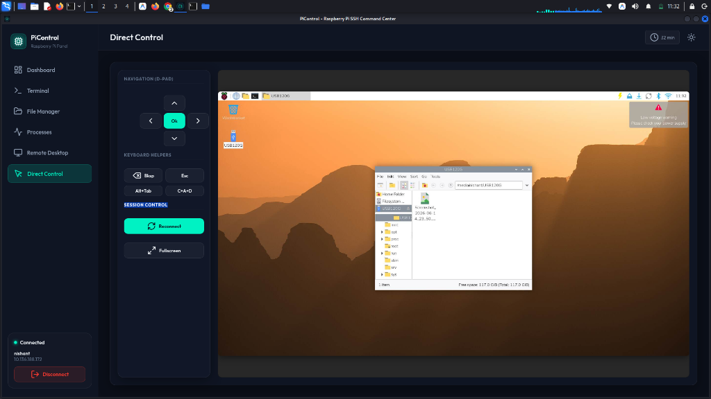
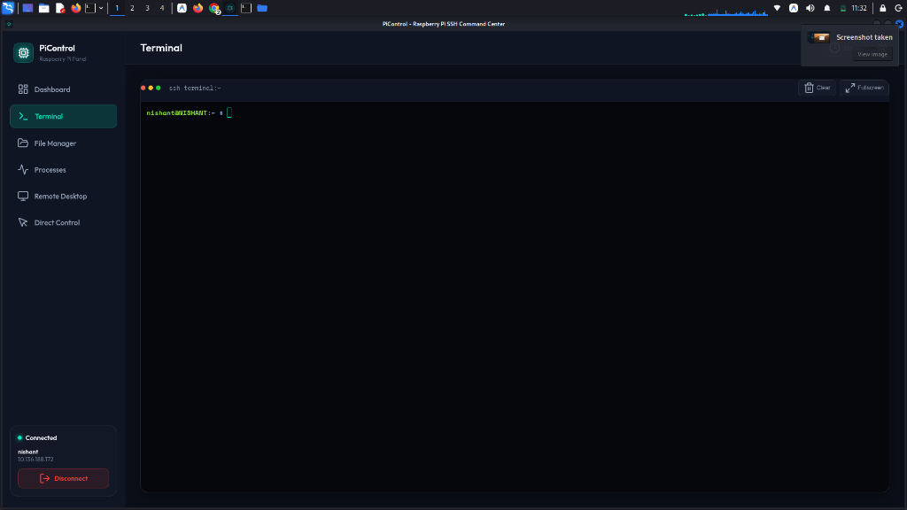
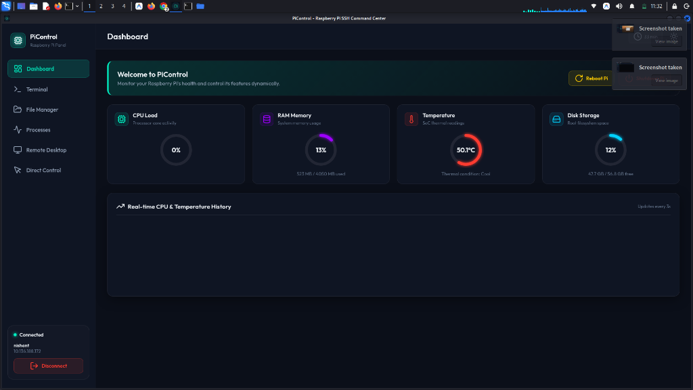

<div align="center">


# 🚀 PiControl — Raspberry Pi Command Center

**A premium, cross-platform dashboard & control center to monitor and manage your Raspberry Pi remotely.**

[](#)
[](#)
[](#)
[](#)
[](#)

---

### 📖 Table of Contents
- [⚡ Quick Start Guide](#-quick-start-guide)
- [🇮🇳 Complete Usage Guide (Hindi / Hinglish)](#-complete-usage-guide-hindi--hinglish)
- [📸 Features & Screenshots](#-features--screenshots)
- [🛡️ Security & Performance Enhancements](#️-security--performance-enhancements)
- [🏗️ System Architecture](#️-system-architecture)
- [💻 Platform Installation & Build Guides](#-platform-installation--build-guides)
  - [🐧 Linux (Ubuntu / Debian / Kali)](#-linux-ubuntu--debian--kali)
  - [🪟 Windows Setup](#-windows-setup)
  - [🤖 Android Setup](#-android-setup)
  - [🌐 Web / PWA Setup](#-web--pwa-setup)
- [🖥️ VNC Remote Desktop Setup](#️-vnc-remote-desktop-setup)
- [🔁 Auto-Start on Raspberry Pi Boot (systemd)](#-auto-start-on-raspberry-pi-boot-systemd)
- [🛠️ Troubleshooting](#️-troubleshooting)

</div>

---

## ⚡ Quick Start Guide

Follow these steps to start PiControl in under 1 minute:

```bash
# 1. Clone or navigate to the project directory
cd pi-control-center

# 2. Install project dependencies
npm install

# 3. Start the server (Listens at http://localhost:3000)
node server.js
```

Once the server starts:
```text
Raspberry Pi Control Center server listening on port 3000
```

1. Open your browser to **`http://localhost:3000`**
2. Enter your Raspberry Pi's details:
   - **Host / IP**: `192.168.1.X` *(Your Raspberry Pi IP address)*
   - **Port**: `22`
   - **Username**: `pi` *(or your Pi username)*
   - **Authentication**: Password or SSH Private Key
3. Click **Connect**!

---

## 🇮🇳 Complete Usage Guide (Hindi / Hinglish)

**PiControl ko use karne ka step-by-step tareeka:**

1. **Terminal kholein** (`Ctrl + Alt + T`).
2. **Project folder me jayein:**
   ```bash
   cd ~/pi-control-center
   ```
3. **Dependencies install karein:**
   ```bash
   npm install
   ```
4. **Server start karein:**
   ```bash
   node server.js
   ```
5. **Browser me kholein:**
   - Chrome / Firefox / Edge me type karein: `http://localhost:3000`
   - Target Pi IP, Username, aur Password daal kar **Connect** click karein.
6. **Features Kaise Use Karein:**
   - **📊 Dashboard:** Pi ki CPU usage, RAM, Temperature (°C), aur Disk status real-time gauges me dekhein.
   - **💻 Terminal:** Interactive SSH terminal powered by `xterm.js`. Directly Linux commands execute karein.
   - **📁 File Manager (SFTP):** Files explore karein, naya folder banayein, upload/download karein, rename ya delete karein.
   - **⚡ Process Monitor:** Running processes ko CPU% ke basis par dekhein aur kisi process ko PID se terminate (kill) karein.
   - **🖥️ Remote Desktop (VNC):** Graphical desktop viewport use karke Pi ka GUI live control karein.

---

## 📸 Features & Screenshots

<table>
  <tr>
    <td><br/><b>📊 Live Dashboard</b> — Real-time CPU, RAM, Temp & Disk monitoring</td>
    <td><br/><b>💻 SSH Terminal</b> — Full interactive xterm.js terminal</td>
  </tr>
  <tr>
    <td><br/><b>📁 SFTP File Manager</b> — Secure uploads, downloads & file actions</td>
    <td><br/><b>⚡ Process Manager</b> — View and terminate processes cleanly</td>
  </tr>
</table>

| Feature | Description |
|---|---|
| 📊 **Live Telemetry** | Low-latency `/proc/` metrics for CPU Usage, RAM, System Temp & Disk space |
| 💻 **SSH Web Console** | Full-color interactive shell powered by `xterm.js` |
| 📁 **SFTP File Browser** | Browse, upload, download, rename, and safely delete remote files |
| ⚡ **Process Manager** | Monitor system processes sorted by CPU and terminate with numeric PID validation |
| 🖥️ **Remote Desktop (VNC)** | Built-in noVNC proxy for full GUI control over your Raspberry Pi |
| 🔌 **Power Management** | Remote Reboot and Power Shutdown options |
| 🌐 **Multi-Platform** | Native Web App, Windows EXE, Linux AppImage/DEB, & Android APK |

---

## 🛡️ Security & Performance Enhancements

- **🔒 Crypto Session Tokens**: File uploads and downloads require cryptographically generated session tokens to prevent unauthorized file access.
- **🛡️ Shell Input Escaping**: Path commands use strict single-quote escaping to prevent shell command injection.
- **🔢 Strict PID Validation**: Process kill commands enforce digit-only validation (`/^\d+$/`).
- **🌐 VNC SSRF Protection**: The VNC WebSocket proxy restricts target ports (5900-5999) to prevent arbitrary TCP relaying.
- **⚡ Instant Telemetry**: Replaced blocking `vmstat` polling with instant non-blocking `/proc/stat` delta calculations.

---

## 🏗️ System Architecture

```text
┌─────────────────────────────────────────────────────────┐
│              Client App / Browser                       │
│    (Windows EXE • Linux AppImage • Android APK • Web)   │
└──────────────────────────┬──────────────────────────────┘
                           │ WebSocket / HTTP (Port 3000)
                           ▼
┌─────────────────────────────────────────────────────────┐
│               PiControl Node.js Server                  │
│               Express + Socket.io Server                │
└──────────────────────────┬──────────────────────────────┘
                           │ SSH / SFTP (Port 22)
                           │ VNC Proxy  (Port 5900-5999)
                           ▼
┌─────────────────────────────────────────────────────────┐
│                  Raspberry Pi OS                        │
└──────────────────────────┬──────────────────────────────┘
```

---

## 💻 Platform Installation & Build Guides

### 🐧 Linux (Ubuntu / Debian / Kali)

#### Option 1: Run via Node.js Server (Recommended for CLI & Devs)
```bash
git clone https://github.com/picontrol/pi-control-center.git
cd pi-control-center
npm install
node server.js
```

#### Option 2: Electron Desktop App
```bash
npm run desktop
```

#### Option 3: Build & Install `.deb` Package
```bash
npm run package:linux
sudo dpkg -i dist/pi-control-center_1.0.0_amd64.deb
```

#### Option 4: Portable AppImage
```bash
chmod +x dist/PiControl-1.0.0.AppImage
./dist/PiControl-1.0.0.AppImage
```

---

### 🪟 Windows Setup

#### Option 1: Portable Executable
Double-click `dist/PiControl 1.0.0.exe` directly to launch the standalone desktop app.

#### Option 2: Build Executable from Source
```cmd
npm install
npm run package:win
```
The output portable EXE is created in `dist/PiControl 1.0.0.exe`.

---

### 🤖 Android Setup

#### Option 1: Sideload Prebuilt APK
1. Transfer `PiControl.apk` to your Android device.
2. Open Settings → Security → Enable **Install Unknown Apps**.
3. Tap `PiControl.apk` to install and launch.

#### Option 2: Build APK with Gradle CLI
```bash
cd android
./gradlew assembleDebug
# Generated APK at: android/app/build/outputs/apk/debug/app-debug.apk
```

---

### 🌐 Web / PWA Setup

1. Run `node server.js`.
2. Open `http://<YOUR_SERVER_IP>:3000` on any mobile device or PC browser.
3. Click **Add to Home Screen** / **Install App** to run as a native Progressive Web App.

---

## 🖥️ VNC Remote Desktop Setup

To stream your Raspberry Pi desktop graphics:

1. **Enable VNC on your Raspberry Pi:**
   - **Raspberry Pi OS (Bookworm / Wayland):**
     ```bash
     sudo apt install wayvnc
     wayvnc 0.0.0.0 5900
     ```
   - **Legacy X11 / Raspberry Pi OS (Bullseye):**
     ```bash
     sudo raspi-config
     # Interface Options -> VNC -> Enable
     ```
2. In PiControl, switch to the **Remote Desktop** view, select port `5900`, and click **Start VNC Session**.

---

## 🔁 Auto-Start on Raspberry Pi Boot (systemd)

Run the PiControl server automatically on boot:

1. Create a systemd unit file:
   ```bash
   sudo nano /etc/systemd/system/picontrol.service
   ```
2. Add the following content:
   ```ini
   [Unit]
   Description=PiControl Command Center Bridge
   After=network.target

   [Service]
   Type=simple
   User=pi
   WorkingDirectory=/home/pi/pi-control-center
   ExecStart=/usr/bin/node server.js
   Restart=on-failure
   RestartSec=5

   [Install]
   WantedBy=multi-user.target
   ```
3. Enable and start the daemon:
   ```bash
   sudo systemctl daemon-reload
   sudo systemctl enable picontrol.service
   sudo systemctl start picontrol.service
   ```

---

## 🛠️ Troubleshooting

- **Error: `Cannot find module 'ssh2'` or `express`**
  - Solution: Run `npm install` in the project directory.
- **Port 3000 is in use:**
  - Solution: Stop existing process using port 3000:
    ```bash
    fuser -k 3000/tcp
    ```
- **Connection Refused on Port 22:**
  - Solution: Enable SSH service on the Pi (`sudo systemctl enable --now ssh`).

---

## 📄 License

Distributed under the MIT License. Built with ❤️ for the Raspberry Pi community.
